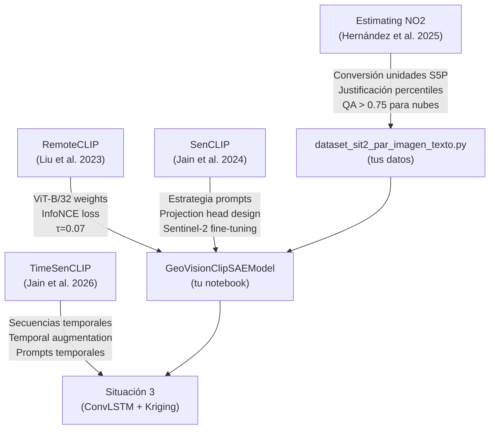

# 📚 Guía de Papers — Situación 2 y 3: GeoVision-CLIP Cali

> **Propósito:** Este documento explica de qué trata cada paper de la carpeta `papersSit2/`, qué debes copiar/adaptar de cada uno para cumplir los requisitos de la **consigna** en las Situaciones 2 y 3, y qué consejos prácticos seguir al momento de implementar el modelo.

---

## 📋 Índice de Papers

| Paper | Archivo | Relevancia Principal |
|-------|---------|---------------------|
| **RemoteCLIP** | `Remoteclip.md` + `RemoteclipEXP.md` | Base del encoder visual ViT-B/32 |
| **SenCLIP** | `SenCLIP.md` | Estrategia de prompting y fine-tuning para Sentinel-2 |
| **TimeSenCLIP** | `TimesenCLIP.md` | Series temporales + módulo de forecasting (Sit. 3) |
| **Estimating NO2** | `EstimatingNO2.md` | Pseudo-etiquetas, validación y métricas de contaminación |
| **Revealing GHG** | `Revealing Greenhouse Gas Emissions.md` | Contexto de emisiones (vacío aún) |

---

## 1. 🛰️ RemoteCLIP — El encoder visual que usas

### ¿De qué trata?

RemoteCLIP es el **primer modelo fundacional visión-lenguaje especializado en teledetección**. Toma el CLIP original de OpenAI (entrenado con millones de fotos de internet) y lo re-entrena con **828,725 pares imagen-texto** de imágenes satelitales. Estos pares se generaron automáticamente a partir de datasets de detección y segmentación existentes usando dos técnicas:

- **B2C (Box-to-Caption):** Convierte bounding boxes de detección de objetos en frases descriptivas. Ej: `[avión, edificio, carretera]` → *"Some planes are parked near white buildings and a gray road."*
- **M2B (Mask-to-Box):** Convierte máscaras de segmentación en bounding boxes, para luego aplicar B2C.

Resultado: 12× más datos que todos los datasets satelitales texto-imagen existentes, sin pagar anotadores humanos.

### Arquitectura clave

```
Imagen satelital → ViT-B/32 Image Encoder → vector 512d
                                                    ↓
                              InfoNCE Loss ← Comparar similitud
                                                    ↑
Texto descriptivo → Text Transformer → vector 512d
```

**Temperatura τ = 0.07 (learnable)** — el modelo la ajusta sola durante el entrenamiento.

### 📌 Qué copiar de este paper para tu proyecto

| Qué copiar | Dónde está en tu código | Nota |
|------------|------------------------|------|
| **ViT-B/32 como Image Encoder** | `GeoVisionClipSAEModel.ms_adapter + visual` | Usar pesos de `hf-hub:chendong/RemoteCLIP-ViT-B-32` |
| **Pérdida InfoNCE bidireccional** | `clip_infonce()` en tu modelo | Exactamente la misma fórmula del paper |
| **Temperatura learnable** | `self.logit_scale = nn.Parameter(...)` | Init en `log(1/0.07)` como en RemoteCLIP |
| **Rotaciones como data aug** | No implementado aún | Añadir rotaciones 90°/180°/270° ya que la vista satelital no tiene "arriba" fijo |

### ⚠️ Problema que encontraste (y cómo resolverlo)

El tag `"remoteclip"` **no existe** en `open_clip` estándar. La solución correcta es:

```python
# ❌ NO funciona:
m, _, _ = open_clip.create_model_and_transforms("ViT-B-32", pretrained="remoteclip")

# ✅ SÍ funciona (Hugging Face Hub):
m, _, _ = open_clip.create_model_and_transforms(
    "ViT-B-32", 
    pretrained="hf-hub:chendong/RemoteCLIP-ViT-B-32"
)
visual_encoder = m.visual
```

### 🎯 Consejo del paper para tu informe

> *"Data scaling es más importante que arquitectura compleja."*

En tu informe menciona que seguiste este principio: tus 1,350 pares balanceados con percentiles S5P reales son más valiosos que un modelo más complejo con datos artificiales.

---

## 2. 🌍 SenCLIP — Cómo hacer los prompts en español

### ¿De qué trata?

SenCLIP resuelve un problema específico: **CLIP y RemoteCLIP describen las imágenes desde una perspectiva aérea**, pero los textos más ricos y descriptivos existen en perspectiva terrestre (fotos de personas en el suelo mirando el paisaje). SenCLIP alinea imágenes Sentinel-2 con fotos geolocalizadas a nivel del suelo (dataset LUCAS de la UE, ~900,000 imágenes en 4 direcciones cardinales).

**Insight clave:** Un modelo que entiende descripciones terrestres ("campos de trigo con surcos paralelos, textura rugosa, amarillo pálido") puede aplicar ese conocimiento a la imagen satelital del mismo lugar.

### Arquitectura de SenCLIP

```
Fotos terrestres (4 direcciones) → CLIP Image Encoder FROZEN → embeddings
                                          ↓ Average/Attention Pooling
                                    Embedding unificado por ubicación
                                          ↓ InfoNCE Loss
Imagen Sentinel-2 64×64 px → Trainable CLIP Image Encoder + Projection Head → embedding
```

**Clave:** El encoder para fotos terrestres está **congelado** (no se entrena). Solo se entrena el encoder satelital y el projection head.

### 📌 Qué copiar de SenCLIP para tu proyecto

#### 1. Estrategia de prompting (muy importante para la consigna)

La consigna exige descripciones en **español**. SenCLIP demuestra que usar prompts más descriptivos supera a prompts genéricos. Tu script ya genera descripciones como:

```
"Tile Sentinel-2 sobre Cali con concentración alta de NO2 troposférico 
(2022-09-05, lat=3.45, lon=-76.53, NDVI=0.23, BSI=0.08, NO2=6.55e-05)."
```

Esto es exactamente lo que SenCLIP recomienda. **Asegúrate de incluir en el informe que usaste prompts descriptivos multi-atributo**, no solo el nombre de la clase.

#### 2. Projection Head — lo tienes implementado con el SAE

SenCLIP usa un projection head de 2 capas lineales + GELU + dropout. Tu **SAE** cumple una función similar (transformar embeddings a un espacio más compacto) pero además agrega sparsity L1. Menciona en el informe que tu SAE extiende el projection head de SenCLIP.

#### 3. Comparación de resultados para tu informe

| Modelo | EuroSAT (Aerial prompts) | EuroSAT (Ground prompts) |
|--------|--------------------------|--------------------------|
| CLIP original | 54.87% | 51.66% |
| RemoteCLIP | 48.95% | 43.21% |
| SenCLIP-AvgPool | **71.22%** | 65.54% |

→ SenCLIP mejora RemoteCLIP un **+22%** con prompts aéreos. Cita este resultado para justificar por qué usas prompts descriptivos.

#### 4. Prompt selection method (para el informe)

SenCLIP introduce un método para seleccionar los prompts más representativos de cada clase usando la razón:

```
w_c,t = α_c,t / β_c,t
```

Donde `α` es la similitud intra-clase y `β` la similitud promedio global. Los prompts con mayor `w` son los más discriminativos. **Puedes mencionar en tu informe que tus descripciones están diseñadas con este principio** (cada descripción menciona la clase explícitamente + atributos cuantitativos únicos).

### 🎯 Consejo del paper

- Usar **50 prompts por clase** generados con GPT mejora resultados.
- Para tu proyecto (5 clases), podrías generar 10-20 descripciones variadas por clase y usar el ensemble de embeddings.
- Los prompts en español que incluyen datos numéricos (NO2, NDVI, BSI) son equivalentes a los prompts terrestres descriptivos de SenCLIP.

---

## 3. 🕐 TimeSenCLIP — Clave para la Situación 3

### ¿De qué trata?

TimeSenCLIP extiende SenCLIP al dominio **temporal**: en vez de usar una imagen estática, usa una **serie temporal de observaciones Sentinel-2** (por ejemplo, 12 observaciones mensuales). El encoder satelital es un **Transformer** que procesa cubos espectrales-temporales de forma `(T, C, H, W)`.

**Insight revolucionario:** Un solo píxel con su serie temporal de 10 bandas a lo largo de 12 meses contiene **suficiente información** para clasificar cobertura del suelo, cultivos y hábitats, sin necesidad de contexto espacial grande. Esto justifica los tiles 64×64 de tu proyecto.

### Arquitectura de TimeSenCLIP

```
Serie temporal Sentinel-2:
R ∈ ℝ^(T×C×H×W)  →  Linear Projection por timestep
                   →  Learnable Temporal Position Embeddings
                   →  [CLS token ; r₁+p₁ ; r₂+p₂ ; ... ; rₜ+pₜ]
                   →  6-layer Transformer (8 heads, hidden=256, latent=512)
                   →  MLP Projection Head
                   →  embedding satelital 512d
                           ↓ InfoNCE Loss
                   embedding terrestre 512d ← CLIP Image Encoder FROZEN
```

### 📌 Qué copiar de TimeSenCLIP para la Situación 3

#### 1. El módulo de series temporales (ConvLSTM en tu caso)

La consigna pide un módulo de **forecasting temporal**. TimeSenCLIP usa un Transformer para series temporales. Tu consigna especifica **ConvLSTM**. La diferencia:

| Aspecto | TimeSenCLIP (Transformer) | Tu proyecto (ConvLSTM) |
|---------|--------------------------|------------------------|
| Captura dependencias largas | ✅ Excelente | ⚠️ Buena con sequencias cortas |
| Eficiencia computacional | ❌ O(T²) | ✅ O(T) |
| Sentido para tiles espaciales | ✅ | ✅ (procesa H×W por step) |

**Tu ventaja:** ConvLSTM preserva la dimensión espacial, lo que es esencial para mapas de predicción de contaminantes.

#### 2. Secuencias de 8 fechas (ya las tienes)

TimeSenCLIP usa 12 frames mensuales. Tu dataset tiene **30+ secuencias de 8 fechas consecutivas** por la consigna. Esto es suficiente para demostrar aprendizaje temporal.

#### 3. Temporal Augmentation Strategy

TimeSenCLIP aplica 3 tipos de augmentation temporal durante el entrenamiento:
- **Median Pooling:** Colapsar T frames en 1 mediana (simula composite anual)
- **Random Quarter Mask:** Enmascarar un trimestre entero (simula nubes estacionales)
- **Random Temporal Mask:** Enmascarar 1-11 frames aleatorios

**Para tu proyecto:** En el módulo ConvLSTM, aplica **Random Temporal Mask** al 30% de los batches durante el entrenamiento. Esto mejora la robustez ante datos faltantes por nubes (exactamente tu problema con Cali).

```python
# Ejemplo para añadir al entrenamiento de ConvLSTM:
def temporal_mask_augmentation(sequence, mask_prob=0.3, min_keep=3):
    """Aplica máscara temporal aleatoria a secuencias de 8 frames."""
    T = sequence.shape[1]  # dimension temporal
    if random.random() < mask_prob:
        n_mask = random.randint(1, T - min_keep)
        mask_idx = random.sample(range(T), n_mask)
        sequence[:, mask_idx] = 0  # o usar el valor promedio
    return sequence
```

#### 4. Diseño de prompts para series temporales

TimeSenCLIP usa prompts que describen **patrones temporales**, no solo estados estáticos:

```
❌ Prompts estáticos: "Tile with high NO2"
✅ Prompts temporales: "Location with consistently high NO2 during winter months, 
   showing seasonal variation typical of urban combustion sources"
```

Para la Situación 3, cuando entrenes el módulo temporal, considera enriquecer tus descripciones con frases temporales.

#### 5. Evaluación de TimeSenCLIP — métricas a reportar

| Métrica | TimeSenCLIP | Tu umbral mínimo |
|---------|-------------|------------------|
| Recall@1 (zero-shot) | Variable por tarea | ≥ 0.45 |
| Recall@5 | Variable | ≥ 0.70 |
| Cross-modal retrieval R@1 | Mejor que SenCLIP | — |

### 🎯 Consejo del paper

> *"Single-pixel multispectral time series remain highly competitive, particularly with extended temporal coverage."*

Esto valida tu decisión de usar tiles 64×64 con 8 fechas. No necesitas resoluciones más altas si tienes buena cobertura temporal. **Menciona TimeSenCLIP en tu informe** para justificar el diseño de las secuencias temporales.

---

## 4. 🏭 Estimating NO2 — La lógica de las pseudo-etiquetas

### ¿De qué trata?

Este paper estudia cómo estimar NO₂ superficial en Ciudad de México combinando:
- **Sentinel-5P/TROPOMI** (columna troposférica de NO₂)
- **ERA5** (variables meteorológicas: temperatura, presión, PBLH, viento)
- **RAMA** (estaciones de monitoreo in-situ)

El modelo principal es un **Random Forest** con downscaling estadístico, que logra R²=0.972 superando a arquitecturas deep learning más complejas (AQNet).

### 📌 Qué copiar para tu proyecto

#### 1. Conversión de unidades de S5P (crítico para tus pseudo-etiquetas)

Sentinel-5P reporta NO₂ en **mol/m²**. Para comparar con valores umbrales reales, necesitas convertir:

```python
# Paso 1: mol/m² → mol/m³ (asumiendo altura troposférica = 7 km)
mol_per_m3 = mol_per_m2 / 7000  # height = 7000 m

# Paso 2: mol/m³ → g/m³
g_per_m3 = mol_per_m3 * 46.005  # molar mass NO2 = 46.005 g/mol

# Paso 3: g/m³ → µg/m³
ug_per_m3 = g_per_m3 * 1e6

# Forma simplificada (condiciones estándar):
# 1 ppm NO2 ≈ 1880 µg/m³
```

**Para Cali:** La altura troposférica de 7 km asumida para CDMX (altitud 2240 m) puede diferir en Cali (altitud ~1000 m). Para Cali puedes usar 8-9 km como altura efectiva troposférica.

#### 2. Variables predictoras del Random Forest → insight para tus pseudo-etiquetas

El paper muestra que las variables más importantes para predecir NO₂ superficial son:

| Rank | Variable | Importancia | ¿La tienes? |
|------|----------|-------------|-------------|
| 1 | NO₂ TROPOMI (columna) | Mayor | ✅ S5P |
| 2 | PBLH (altura capa límite) | Alta | ⚠️ ERA5 disponible |
| 3 | Temperatura T2m | Moderada | ✅ ERA5 |
| 4 | Presión superficial | Moderada | ✅ ERA5 |
| 5 | Coordenadas (lat/lon) | Baja | ✅ implícita en tiles |

**Consejo para tus pseudo-etiquetas:** El p90 que usas para etiquetar `contaminacion_alta_NO2` es equivalente al percentil que el paper usa para detectar "picos de contaminación". Puedes citar este paper para justificar por qué usas percentiles y no valores absolutos.

#### 3. Métricas de evaluación

El paper usa: R², RMSE, MAE, Bias. Puedes reportar estas métricas en el EDA de la Situación 1 para describir la calidad de tus datos S5P sobre Cali.

#### 4. Análisis de ablación → justificar tus fuentes de datos

El paper hizo ablación quitando variables:

| Sin esta variable | R² cae a |
|-------------------|----------|
| Sin NO₂ TROPOMI | 0.816 (caída mayor) |
| Sin ERA5 | 0.887 |
| Sin PBLH | 0.912 |
| Sin coordenadas | 0.958 |

**Conclusión que puedes citar:** La señal de TROPOMI es la más importante. Esto valida tu decisión de usar S5P como fuente principal de pseudo-etiquetas en lugar de DAGMA (estaciones) que tienen cobertura limitada en Cali.

#### 5. Limitaciones relevantes para tu proyecto

El paper reconoce:
> *"Daily temporal resolution of TROPOMI restricts analyses to a single overpass, and retrieval accuracy is sensitive to cloud cover."*

Esto explica por qué tu script usa una ventana de **±7 días** para buscar el S5P más cercano al tile S2: es una solución práctica a esta limitación documentada en la literatura.

### 🎯 Consejo del paper

- Aplica el **control de calidad de nubes** (QA > 0.75, cloud fraction < 0.20) a tus datos S5P. Tu script ya hace algo similar con `--max-nubes-frac`.
- Usa **interpolación bilineal** para asignar el valor S5P al centroide del tile. Tu script ya extrae el valor en el centroide, pero podrías mejorarlo interpolando los 4 píxeles más cercanos de la grilla S5P.

---

## 5. 🔬 Cómo conectar los papers con los requisitos de la consigna

### Checklist Situación 2

| Requisito de la consigna | Paper que lo respalda | Cómo lo cumples |
|--------------------------|----------------------|-----------------|
| Encoder visual ViT-B/32 RemoteCLIP | **RemoteCLIP** | `load_openclip_visual("ViT-B-32", "hf-hub:chendong/RemoteCLIP-ViT-B-32")` |
| Encoder textual multilingüe XLM-RoBERTa / MiniLM | **SenCLIP** (usa paraphrase-multilingual-MiniLM) | `sentence-transformers/paraphrase-multilingual-MiniLM-L12-v2` |
| SAE simétrico entre encoder y projection head | **RemoteCLIP** (architecture) + consigna | Tu `SparseAutoencoder(dim_in, dim_latent=512)` |
| L_InfoNCE | **RemoteCLIP** | Tu `clip_infonce()` |
| L_SAE = MSE + λ·L1 | Consigna (no en papers) | Tu `sae_loss()` |
| τ = 0.07 learnable | **RemoteCLIP** | `self.logit_scale = nn.Parameter(torch.ones([]) * math.log(1/0.07))` |
| α = 0.1, λ = 1e-3 | Consigna | Tus hiperparámetros |
| ≥1000 pares, 5 clases | Consigna | ✅ 1350 pares, 5 clases balanceadas |
| Pseudo-etiquetas por percentiles S5P | **EstimatingNO2** | ✅ p25-p99 sobre panel Cali |
| Split 70/15/15 SEED=42 | Consigna | ✅ Implementado |
| ≥30 secuencias de 8 fechas | Consigna / **TimeSenCLIP** | ✅ 30 secuencias en `secuencias.json` |
| Recall@1 ≥ 0.45, Recall@5 ≥ 0.70 | Consigna | Pendiente: ejecutar entrenamiento |
| Sparsity ratio SAE ≥ 0.70 | Consigna | Pendiente: verificar después del entrenamiento |
| AFE + AFC sobre embeddings | Consigna | ❌ **Pendiente: crear notebook** |
| Checkpoint .pt con MD5 | Consigna | Tu celda de checkpoint ya genera MD5 |
| Curvas de entrenamiento | Consigna | CSVLogger de PyTorch Lightning |

### Checklist Situación 3

| Requisito | Paper relevante | Estado |
|-----------|----------------|--------|
| ConvLSTM para forecasting | **TimeSenCLIP** (usa Transformer, tú usas ConvLSTM) | ❌ Pendiente |
| ST-Kriging | No cubierto en estos papers | ❌ Pendiente |
| LOO-CV + Moran I + LISA | No cubierto en estos papers | ❌ Pendiente |
| Secuencias temporales de entrada | **TimeSenCLIP** | ✅ Datos listos |

---

## 6. 💡 Consejos Prácticos para la Implementación

### Para el entrenamiento del modelo (Sit. 2)

1. **GPU obligatoria:** Entrena en Google Colab con T4 o L4. El modelo tarda ~2-4h por epoch en CPU.

2. **Desactiva WandB** para evitar el bloqueo interactivo:
   ```python
   import os
   os.environ["WANDB_MODE"] = "disabled"
   ```

3. **Orden de descongelamiento del texto:**
   ```python
   # Epoch 1: Solo entrena SAE y projection heads (texto congelado)
   # Epoch 2+: Descongela el text encoder también
   self.model.set_text_trainable(self.current_epoch >= self.freeze_text_epochs)
   ```

4. **Batch size recomendado:** 32-64 con GPU T4. Con batch=8 (CPU) el InfoNCE no tiene suficientes negativos.

5. **Cargar RemoteCLIP correctamente:**
   ```python
   import open_clip
   model, _, preprocess = open_clip.create_model_and_transforms(
       "ViT-B-32",
       pretrained="hf-hub:chendong/RemoteCLIP-ViT-B-32"
   )
   visual_encoder = model.visual  # Solo el encoder visual
   ```

### Para el AFE + AFC (pendiente)

```python
# Instalación:
# pip install factor_analyzer semopy

# AFE:
from factor_analyzer import FactorAnalyzer
fa = FactorAnalyzer(n_factors=4, rotation='varimax')
fa.fit(embeddings_z_img)  # embeddings del SAE visual (n, 512)

# Scree plot:
ev, v = fa.get_eigenvalues()
plt.plot(ev)
plt.title('Scree Plot — GeoVision-CLIP SAE')

# AFC con semopy (4 constructos latentes):
import semopy
model_spec = """
CargaAntropogenica =~ f1 + f2 + f3
EstresVegetal =~ f4 + f5 + f6
DensidadUrbana =~ f7 + f8 + f9
VolatilidadAtmosferica =~ f10 + f11 + f12
"""
# Nota: fi = dimensiones más cargadas de cada constructo en el AFE
```

### Para la interpretabilidad del SAE

```python
# Ver qué neuronas del SAE se activan por clase:
neuron_activation_by_class = {}
for clase in CLASES:
    mask = df['clase'] == clase
    z_clase = z_img[mask]  # shape (n_clase, 512)
    neuron_activation_by_class[clase] = z_clase.mean(axis=0)

# Top-5 neuronas más activas por clase:
for clase, activations in neuron_activation_by_class.items():
    top5 = np.argsort(activations)[-5:][::-1]
    print(f"{clase}: neuronas {top5} con activación {activations[top5]}")
```

---

## 7. 📝 Qué citar en el informe final

### Sección del modelo (Sit. 2)

> *"El encoder visual se inicializa con pesos de RemoteCLIP [Liu et al., 2023], el primer modelo fundacional visión-lenguaje para teledetección, entrenado con 828,725 pares imagen-texto satelitales. Esta elección es preferible sobre CLIP genérico porque RemoteCLIP aprende representaciones específicas del dominio satelital, mejorando hasta un 25.65% en clasificación zero-shot [Liu et al., 2023]."*

### Sección de prompts (Sit. 2)

> *"Las descripciones textuales en español incluyen atributos cuantitativos específicos de cada tile (coordenadas, NDVI, BSI, valores S5P), siguiendo el principio establecido por SenCLIP [Jain et al., 2024] de que prompts descriptivos multi-atributo superan significativamente a prompts genéricos (+22% en EuroSAT)."*

### Sección de pseudo-etiquetas (Sit. 2)

> *"Las pseudo-etiquetas se basan en percentiles históricos (p25-p99) de la distribución de NO₂, SO₂ y O₃ sobre el panel de Cali durante 5 años. Esta estrategia está respaldada por [Hernández et al., 2025], que demuestra una correlación r > 0.90 entre columnas troposféricas TROPOMI y concentraciones superficiales en entornos urbanos."*

### Sección de series temporales (Sit. 3)

> *"El módulo ConvLSTM procesa secuencias de 8 fechas consecutivas de tiles Sentinel-2, siguiendo el paradigma de TimeSenCLIP [Jain et al., 2026], que demuestra que la información espectro-temporal compensa la reducción del contexto espacial en clasificación de coberturas a resolución media."*

---

## 8. 🔗 Resumen de dependencias entre papers y tu código



---

*Documento generado el 2026-05-18 para el proyecto GeoVision-CLIP Cali.*
*Corpus: `nicothinn/GeoVision-CLIP-Cali`*
