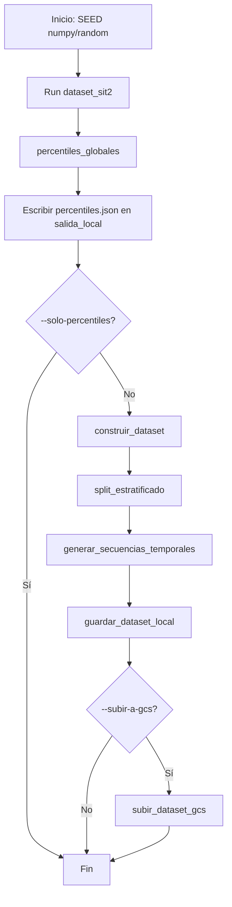

# Guía del pipeline: `pipeline/dataset_sit2_par_imagen_texto.py`

Este documento describe el script que construye el **dataset de pares imagen–texto** para la Situación 2 del proyecto (GeoVision-CLIP / Cali), incluyendo **entradas**, **salidas**, **flujo de ejecución** y el papel de cada bloque de código.

---

## 1. Objetivo del script

Generar un conjunto de **pares (imagen, texto)** donde:

- **Imagen**: recorte (*tile*) de Sentinel-2 L2A de **64×64 píxeles** y **13 bandas** (incluye SCL).
- **Texto**: descripción en **español** derivada de la clase pseudo-supervisada y de magnitudes (NO₂, SO₂, O₃, NDVI, BSI, fecha, coordenadas).

Además:

- Pseudo-etiquetas con **percentiles globales** de Sentinel-5P (NO₂, SO₂, O₃) sobre la región.
- **Split estratificado** 70% entrenamiento / 15% validación / 15% prueba (`SEED=42`).
- **Secuencias temporales** de longitud configurable (por defecto 8 fechas) para forecasting (Situación 3).

---

## 2. Entradas (input)

### 2.1 Configuración y credenciales

- `**pipeline/config.py`**: define `PROJECT_GCP`, `BUCKET` (p. ej. `geovision-cali`), `FUENTES` y el prefijo Zarr de cada fuente.
- **Google Cloud**: el script **lee** Zarr en GCS mediante `gcsfs`. Hace falta autenticación ADC (por ejemplo `gcloud auth application-default login`) con permisos de lectura al bucket.

### 2.2 Datos remotos (Zarr en GCS)

Ruta genérica de cada panel:

```text
gs://<BUCKET>/<prefijo>/panel.zarr
```


| Uso en el script   | Prefijo (`config.FUENTES`)                        | Contenido relevante                                                                                                                                |
| ------------------ | ------------------------------------------------- | -------------------------------------------------------------------------------------------------------------------------------------------------- |
| Escenas Sentinel-2 | `Sentinel2` (clave `COPERNICUS/S2_SR_HARMONIZED`) | Variable `data`: `(time, band, y, x)` con 13 bandas en el orden de `BANDAS_S2`. Coordenadas `time`, `y`, `x` (EPSG:4326 en el producto exportado). |
| NO₂                | `Sentinel5P/NO2`                                  | `data` banda 0: columna troposférica (producto L3).                                                                                                |
| SO₂                | `Sentinel5P/SO2`                                  | Igual, banda 0.                                                                                                                                    |
| O₃                 | `Sentinel5P/O3`                                   | Igual, banda 0.                                                                                                                                    |


Los identificadores de tiempo suelen ser strings estilo Earth Engine; el script extrae la fecha con una expresión regular sobre `YYYYMMDD`.

### 2.3 Parámetros de línea de comandos (CLI)

Se definen en `_parse_args()` y se registran en el contexto de la corrida (`Run`).


| Flag                     | Default         | Descripción                                                                        |
| ------------------------ | --------------- | ---------------------------------------------------------------------------------- |
| `--meta-objetivo`        | 1500            | Número objetivo de pares aceptados (filas finales).                                |
| `--max-timestamps-s2`    | 1463            | Máximo de índices temporales S2 a visitar (orden aleatorio reproducible).          |
| `--max-tiles-por-escena` | 40              | Máximo de tiles candidatos por escena (subconjunto aleatorio de la grilla).        |
| `--stride-pix`           | 32              | Paso en píxeles entre orígenes de tiles dentro de la escena.                       |
| `--cap-por-clase`        | 250             | Tope de pares por clase (evita que una clase monopolice el dataset).               |
| `--min-por-clase`        | 10              | Mínimo de pares por clase para considerar cumplida la meta y parar.                |
| `--paciencia-escenas`    | 80              | Escenas seguidas sin ningún par nuevo antes de abortar el bucle.                   |
| `--solo-percentiles`     | off             | Solo calcula y escribe percentiles; no construye pares.                            |
| `--n-secuencias`         | 30              | Objetivo de secuencias temporales a generar.                                       |
| `--longitud-secuencia`   | 8               | Longitud de cada secuencia (número de fechas/tiles).                               |
| `--salida-local`         | `dataset_sit2`  | Directorio local de salida del dataset.                                            |
| `--subir-a-gcs`          | off             | Si se indica, sube recursivamente los archivos del directorio de salida al bucket. |
| `--prefijo-gcs`          | `datasets/sit2` | Prefijo dentro del bucket para la subida opcional.                                 |
| `--dask-workers`         | 0               | Si > 0 y Dask está instalado, evalúa tiles en paralelo con scheduler `threads`.    |
| `--dask-chunk-tiles`     | 16              | Tamaño del bloque de tiles enviado a Dask por escena.                              |
| `--zarr-flush-every`     | 128             | Cada cuántos tiles se vuelca el buffer a disco en `tiles.zarr`.                    |
| `--max-frac-nubes`       | 0.30            | Máxima fracción de píxeles SCL considerados nube/sombra/cirrus.                    |
| `--min-frac-claros`      | 0.10            | Mínima fracción de píxeles SCL “claros”.                                           |
| `--sin-filtro-scl`       | off             | Desactiva el filtro SCL y calcula NDVI/BSI sobre todo el tile.                     |


**Constantes en código** (no son flags): `SEED=42`, `TILE_PIX=64`, `MAX_DT_DIAS=7`, umbrales NDVI/BSI para clases de suelo y vegetación, conjuntos SCL nube/claro.

---

## 3. Salidas (output)

### 3.1 Directorio principal (`--salida-local`)


| Archivo / carpeta   | Descripción                                                                                                                                                                                                                    |
| ------------------- | ------------------------------------------------------------------------------------------------------------------------------------------------------------------------------------------------------------------------------ |
| `tiles.zarr/`       | Almacenamiento Zarr *directory store*. Array principal forma `(N, 13, 64, 64)`, `dtype=int16`. Atributos: `bandas` (lista de nombres de banda), `tile_pix`, `tile_ids` (orden alineado con filas del array y con `metadatos`). |
| `metadatos.parquet` | Una fila por par; columnas listadas en la sección 5. Si falla PyArrow, fallback a `metadatos.csv`.                                                                                                                             |
| `percentiles.json`  | Objeto con claves `NO2`, `SO2`, `O3` y dentro `p25`, `p50`, `p75`, `p90`, `p99`. Se escribe al inicio (tras calcular percentiles) y de nuevo en `guardar_dataset_local`.                                                       |
| `secuencias.json`   | Lista de objetos con secuencias temporales para Sit. 3 (celda espacial, `tile_ids`, `fechas`, `longitud`).                                                                                                                     |
| `resumen.json`      | Metadatos agregados: fechas UTC, conteos, balance por split y global, bandas, `tile_pix`, percentiles embebidos.                                                                                                               |


### 3.2 Trazabilidad de la corrida (`runs/`)

`main()` envuelve la ejecución en `Run("dataset_sit2", ...)`. Por cada ejecución se crea:

```text
runs/<YYYYMMDDTHHMMSSZ>_dataset_sit2/
  log.txt          # log legible
  eventos.jsonl    # un JSON por línea (percentiles, progreso, medir, etc.)
```

Esto **no** sustituye al dataset; sirve para auditoría y depuración.

### 3.3 Subida opcional a GCS

Con `--subir-a-gcs`, `subir_dataset_gcs()` recorre todos los **archivos** bajo `--salida-local` y los sube a:

```text
gs://<BUCKET>/<prefijo-gcs>/<ruta relativa>
```

Requiere `google-cloud-storage` instalado y credenciales con permiso de escritura.

---

## 4. Flujo de ejecución (`main`)




---

## 5. Qué es un “par” y alineación imagen–metadatos

- **Par**: la fila `i` de `metadatos.parquet` corresponde a la fila `i` del eje `N` en `tiles.zarr` (mismo orden que `tile_ids` en los atributos del Zarr).
- `**tile_id`**: identificador único compuesto por `img_id_s2`, posición `yi`, `xi`.

Durante la construcción, cada tile aceptado hace `push` al escritor incremental; al final se llama `finalize_attrs` con la lista de `tile_id` en el mismo orden que el DataFrame.

---

## 6. Desglose por secciones del código

### 6.1 Imports y dependencias

- **Numéricos / datos**: `numpy`, `pandas`, `xarray`, `zarr`, `sklearn.model_selection.train_test_split`.
- **Nube**: `gcsfs` (lectura Zarr), opcionalmente `google.cloud.storage` (subida).
- **Paralelo**: `dask` opcional (`compute`, `delayed`).
- **Proyecto**: `config` (bucket, fuentes), `trazabilidad` (`Run`, `evento`).

### 6.2 Constantes (`SEED`, `TILE_PIX`, `CLASES`, SCL, `MAX_DT_DIAS`)

- `**CLASES`**: orden fijo de las cinco pseudo-clases.
- `**BANDAS_S2**`: orden de canales en el tile (debe coincidir con el Zarr S2).
- `**_SCL_NUBE_O_DUDOSO` / `_SCL_CLARO**`: códigos SCL L2A ESA para filtrar nubes y promediar índices solo en píxeles claros.
- `**MAX_DT_DIAS**`: ventana en días alrededor de la fecha S2 para incluir órbitas S5P y componer mapas 2D.

### 6.3 `_abrir_zarr(prefijo)`

Abre `xr.Dataset` desde `gs://BUCKET/prefijo/panel.zarr` con `consolidated=True`.

### 6.4 Fechas desde `time`

- `**img_id_a_fecha**`: primer grupo `YYYYMMDD` en el string del tiempo.
- `**_times_a_fechas**`: aplica eso a todo el vector de coordenadas `time`.

### 6.5 `calcular_percentiles_globales(run, ...)`

1. Para cada contaminante NO₂, SO₂, O₃ abre el Zarr y muestrea en `time` (cada `step_temporal`) y submuestrea `y`,`x` con `step_espacial`.
2. Filtra valores finitos; para **NO₂ y SO₂** usa solo valores **> 0** para percentiles (los ceros suelen ser “sin retrieval”, no cero físico).
3. Calcula percentiles 25, 50, 75, 90, 99 y registra eventos.

### 6.6 SCL, NDVI, BSI

- `**metricas_scl`**: fracciones de nube, claro y nodata en el tile.
- `**calcular_ndvi_bsi**`: NDVI y BSI por píxel; si hay máscara clara, promedia solo ahí.

### 6.7 `_valor_grilla`

Dado un mapa 2D ya compuesto (ver `_AccesoS5P`), obtiene el valor en el píxel más cercano al centroide; si es NaN, mediana en una ventana de radio `_S5P_BUFFER` (2 píxeles).

### 6.8 `_AccesoS5P`

- `**_cargar**`: cache por producto; construye `fecha_a_indices` (todas las órbitas por fecha calendario, no solo la primera).
- `**_fechas_en_ventana**`: fechas S5P dentro de ±`MAX_DT_DIAS` de la fecha S2.
- `**mapas_2d_para_fecha**`: para cada contaminante, concatena todos los índices `time` de esas fechas, apila en 3D, convierte 0 en NaN y aplica `**nanmax` en el eje tiempo** → un mapa 2D por escena con máxima cobertura entre órbitas.
- `**valor`**: consulta puntual agregada (útil como fallback; el bucle principal usa mapas 2D).

### 6.9 `asignar_clase`

Prioridad estricta:

1. `contaminacion_alta_NO2` si NO₂ finito, > 0 y ≥ p90(NO₂).
2. `contaminacion_alta_SO2` si SO₂ finito, > 0 y ≥ umbral SO₂ (p90 si es positivo; si no, p99).
3. `ozono_anomalo` si O₃ ≥ p90(O₃) **o** O₃ ≤ p25(O₃).
4. `vegetacion_densa` si NDVI ≥ umbral denso.
5. `suelo_urbano` si NDVI ≤ umbral suelo y BSI ≥ umbral BSI.

Si ninguna regla aplica → el tile no genera par (`None`).

### 6.10 `generar_descripcion`

Texto en español fijo por clase + interpolación de fecha, lat/lon, NDVI, BSI, NO₂, SO₂, O₃.

### 6.11 `_procesar_tile_candidato`

Orquesta: filtros SCL opcionales → NDVI/BSI → lectura S5P en grilla → `asignar_clase` → diccionario `record` + `tile_i16`.

### 6.12 `IncrementalTilesZarr`

Escribe `tiles.zarr` por lotes para limitar RAM: buffer de tiles hasta `flush_every`, luego `resize` y append al array Zarr.

### 6.13 `iter_tiles_escena`

Genera posiciones `(yi, xi)` con stride, baraja, trunca a `max_tiles`, filtra por `valid_ratio` mínimo y calcula centroide en coordenadas geográficas del centro del tile.

### 6.14 `construir_dataset`

1. Inicializa `_AccesoS5P`, opcionalmente Dask, `IncrementalTilesZarr` bajo `salida_local/tiles.zarr`.
2. Abre S2, baraja índices temporales, recorre escenas.
3. Condiciones de parada anticipada:
  - Meta global alcanzada **y** cada clase ≥ `min_por_clase`.
  - O `paciencia_escenas` escenas seguidas sin aportar ningún par.
4. Por escena: carga cubo S2, obtiene mapas S5P; si no hay ventana temporal válida, cuenta paciencia.
5. Evalúa candidatos (Dask por bloques o bucle serie).
6. Acepta solo si la clase no supera `cap_por_clase`.
7. Devuelve `DataFrame` de registros y `tiles=None` (el Zarr ya está en disco).

### 6.15 `split_estratificado`

- 70% / 30% sobre índices con `stratify=clase` si es posible.
- Del 30%, mitad val / mitad test (15% / 15% global).
- Si `stratify` falla (clases muy desbalanceadas), split aleatorio sin estratificar en ese paso.

Añade columna `**split`**: `train`, `val`, `test`.

### 6.16 `generar_secuencias_temporales`

- Agrupa tiles por celda (`centroide` redondeado a `cell_deg` grados; por defecto **0.10°**).
- Por grupo ordenado por fecha, busca ventanas deslizantes de longitud `longitud` donde entre fechas consecutivas el salto en días esté en **(0, max_gap_dias]** (es decir, al menos 1 día y a lo sumo `max_gap_dias`, por defecto 90).
- No reutiliza un `tile_id` en más de una secuencia.
- Objetivo: hasta `n_secuencias` entradas en la lista.

### 6.17 `guardar_dataset_local`

1. Escribe parquet/csv de metadatos.
2. Si `tiles` es `None` y el Zarr incremental tiene el mismo `N` que el DataFrame, no reescribe tiles; si no coincide, avisa.
3. Si se pasó un array `tiles` en memoria (ruta poco usada con el flujo actual), escribe Zarr completo.
4. Sobrescribe `percentiles.json`, `secuencias.json`, `resumen.json`.

---

## 7. Esquema de columnas en `metadatos.parquet`


| Columna                                                | Tipo conceptual | Significado                                                      |
| ------------------------------------------------------ | --------------- | ---------------------------------------------------------------- |
| `tile_id`                                              | string          | ID único del par.                                                |
| `clase`                                                | string          | Una de `CLASES`.                                                 |
| `descripcion`                                          | string          | Texto del par (español).                                         |
| `fecha`                                                | string/date     | Fecha de la escena S2 (YYYY-MM-DD).                              |
| `img_id_s2`                                            | string          | Identificador crudo del tiempo en el cubo S2.                    |
| `centroide_lat`, `centroide_lon`                       | float           | Centro del tile en grados.                                       |
| `yi`, `xi`                                             | int             | Origen del recorte en la grilla S2.                              |
| `valid_ratio`                                          | float           | Fracción de valores finitos en el tile bruto.                    |
| `frac_nubes_scl`, `frac_claros_scl`, `frac_nodata_scl` | float           | Métricas SCL del tile.                                           |
| `ndvi`, `bsi`                                          | float           | Índices (medias según máscara).                                  |
| `no2`, `so2`, `o3`                                     | float           | Valores S5P en el centroide (mapa compuesto + buffer si aplica). |
| `split`                                                | string          | `train` / `val` / `test`.                                        |


---

## 8. Ejemplo de comando (PowerShell)

Solo percentiles:

```powershell
python -u pipeline\dataset_sit2_par_imagen_texto.py --solo-percentiles --salida-local dataset_sit2
```

Construcción completa con parámetros típicos para un dataset grande:

```powershell
python -u pipeline\dataset_sit2_par_imagen_texto.py `
  --meta-objetivo 1500 `
  --dask-workers 4 `
  --max-frac-nubes 0.3 `
  --min-frac-claros 0.1 `
  --zarr-flush-every 128 `
  --cap-por-clase 400 `
  --min-por-clase 10 `
  --paciencia-escenas 80 `
  --salida-local dataset_sit2
```

Con subida al bucket al finalizar:

```powershell
python -u pipeline\dataset_sit2_par_imagen_texto.py `
  --salida-local dataset_sit2 `
  --subir-a-gcs `
  --prefijo-gcs datasets/sit2
```

---

## 9. Referencia rápida de módulos / símbolos


| Símbolo                         | Rol                                   |
| ------------------------------- | ------------------------------------- |
| `_abrir_zarr`                   | Lectura remota de paneles.            |
| `calcular_percentiles_globales` | Umbrales pseudo-supervisados.         |
| `_AccesoS5P`                    | Mapas 2D compuestos por fecha S2.     |
| `asignar_clase`                 | Reglas de pseudo-etiqueta.            |
| `_procesar_tile_candidato`      | Un tile → registro o descarte.        |
| `IncrementalTilesZarr`          | Persistencia incremental de imágenes. |
| `iter_tiles_escena`             | Muestreo espacial de candidatos.      |
| `construir_dataset`             | Bucle principal de pares.             |
| `split_estratificado`           | Train/val/test.                       |
| `generar_secuencias_temporales` | Secuencias para Sit. 3.               |
| `guardar_dataset_local`         | Parquet, Zarr, JSON.                  |
| `subir_dataset_gcs`             | Copia opcional a GCS.                 |


---

*Documento generado para el repositorio del proyecto; refleja la lógica del archivo `pipeline/dataset_sit2_par_imagen_texto.py` en el estado del código al momento de escribir esta guía.*